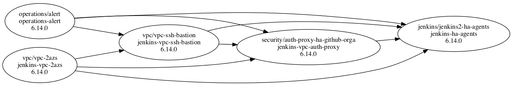

# widdix CLI

`widdix`, a CLI tool to manage [Free Templates for AWS CloudFormation](https://github.com/widdix/aws-cf-templates).

> The widdix CLI is compatible with templates >= v6.13.0

## Install

We provide three ways to install `widdix`. Via `npm`, Docker, or by downloading the binary manually.

### npm

If you have `npx` installed (comes with `npm>=5.2.0`) you can prefix all `widdix` invocations with `npx`. E.g. `npx widdix list --all-profiles`.

Or you can install `widdix` globally with `npm install -g widdix`.

### Docker

Docker image available on Ducker Hub [widdix/widdix](https://hub.docker.com/r/widdix/widdix/).

Usage: `docker run -it --rm -v "$HOME/.aws:/root/.aws:ro" widdix/widdix list --all-profiles`

### Binary

> We don't provide binaries any longer since [pkg](https://www.npmjs.com/package/pkg) does not support ESM.

## AWS Authorization & Authentication (IAM)

### --env

If you append the `--env` parameter, the following environment variables are used: `AWS_ACCESS_KEY_ID`, `AWS_SECRET_ACCESS_KEY`, `AWS_SESSION_TOKEN`

### --profile=<name>

If you append the `--profile=<name>` parameter, the profile is loaded from ` ~/.aws/credentials` (MFA is supported).

### --all-profiles

If you append the `--all-profiles` parameter, all profiles from ` ~/.aws/credentials` are loaded (MFA is supported).

### default

If nothing is specified, the [AWS SDK for Node.js default behavior](https://docs.aws.amazon.com/sdk-for-javascript/v2/developer-guide/setting-credentials-node.html) applies.

## Available Commands

### List

To list all your stacks in an AWS account, run:

```
widdix list
```

A sample output looks like this:

```
-----------------------------------------------------------------------------------------------------------------------------------------
| Stack Account | Stack Region | Stack Name              | Template ID                        | Template Version       | Template Drift |
-----------------------------------------------------------------------------------------------------------------------------------------
| 123456789123  | eu-west-1    | operations-alert        | operations/alert                   | 6.14.0                 | false          |
| 123456789123  | eu-west-1    | jenkins-vpc-auth-proxy  | security/auth-proxy-ha-github-orga | 6.14.0                 | false          |
| 123456789123  | eu-west-1    | jenkins-ha-agents       | jenkins/jenkins2-ha-agents         | 6.13.0 (latest 6.14.0) | false          |
| 123456789123  | eu-west-1    | jenkins-vpc-ssh-bastion | vpc/vpc-ssh-bastion                | 6.14.0                 | false          |
| 123456789123  | eu-west-1    | jenkins-vpc-2azs        | vpc/vpc-2azs                       | 6.14.0                 | false          |
-----------------------------------------------------------------------------------------------------------------------------------------
```

To filter a AWS single region, run:

```
widdix list --region=us-east-1
```

#### Columns

| Column           | Description                                                                            |
| ---------------- | -------------------------------------------------------------------------------------- |
| Stack Account    | AWS account alias or ID.                                                               |
| Stack Region     | AWS region, like `us-east-1`.                                                          |
| Stack Name       | Name of AWS CloudFormation stack.                                                      |
| Template ID      | Template id, like `vpc/vpc-2azs`.                                                      |
| Template Version | Current version of the template. If an update is available it is added in parentheses. |
| Template Drift   | If you modified the template drift is detected.                                        |

### Graph



To generate a graph in [DOT](https://graphviz.gitlab.io/_pages/doc/info/lang.html) format of your stacks in an AWS account, run:

```
widdix graph
```

To filter a single AWS region, run:

```
widdix graph --region=us-east-1
```

Do visualize the graph in a png file, pipe stdout to `dot`:

```
widdix graph | dot -Tpng > graph.png
```

If you don't have `dot` installed, you can also use Docker:

```
widdix graph | docker run -i robhaswell/dot-docker -Tpng > graph.png
```

### Update

If a new version of the template is released, you can update your existing stacks. To update all stacks in interactive mode, run:

```
widdix update
```

The update behaves as follows:

1. If no updates are available, an error is thrown.
1. If template drift is detected we do not recommend to update! You have to confirm this potentially destructive action by typing `yes`.
1. Planed changes (using AWS CloudFormation change sets) that are necessary to migrate to the new version are displayed. 
1. You have to confirm the changes by typing `yes`.
1. Changes are applied and CloudWatch events are streamed to your screen.

You can filter AWS CloudFormation stacks based on region and/or AWS CloudFormation stack name like this:

```
widdix update --region=us-east-1 --stack-name=vpc
```

## Future Commands

### Catalogue

List all available templates that can be installed.

> Not yet implemented!

### Get

Get information about a single stack.

> Not yet implemented!

### Create

Create a new stack from a template in the catalogue. If the template needs connect to dependent stacks, you will be asked to select one of the existing stacks (if available) or to create the dependent stack as well.

> Not yet implemented!

### Delete

> Not yet implemented!

## Config

### Proxy

The `HTTPS_PROXY` environment variable is used if set.

## Debug

If something goes wrong, a log file (`widdix.log`) is written to the current working directory.

If you append the `--debug` parameter the log will be more verbose.
